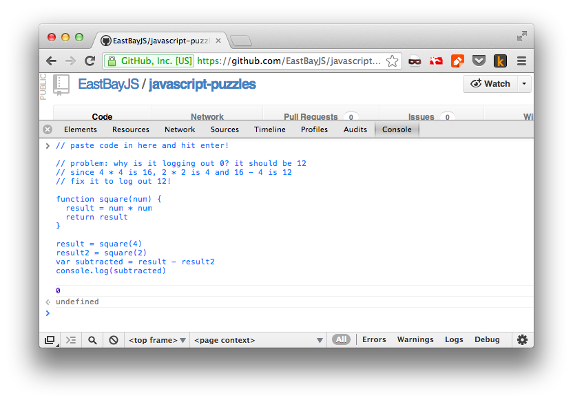
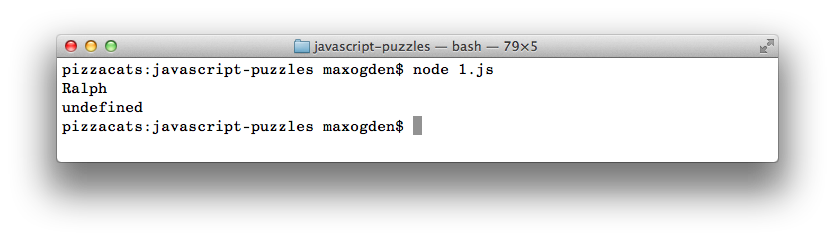

javascript-puzzles
==================

Improve your JavaScript skills by correcting the errors in this code.

You can run this in the browser by copy and pasting each exercise into your browsers JavaScript console:

Or on the command line using [node.js](http://nodejs.org):

## contributing

If you have an idea for a puzzle that will teach someone an important JS concept then please submit it as a pull request!

## license

BSD

## credits

some puzzles adapted from http://liamkaufman.com/blog/2012/09/09/common-javascript-errors/